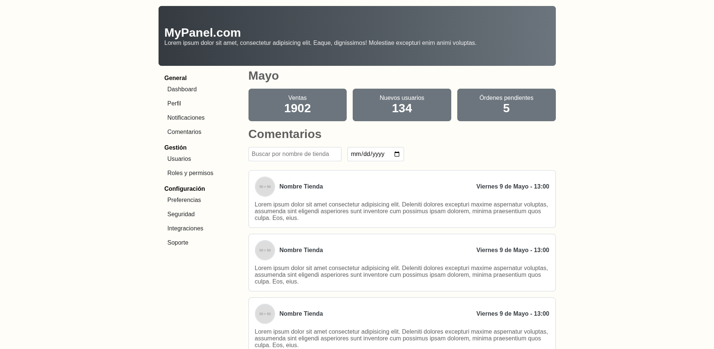
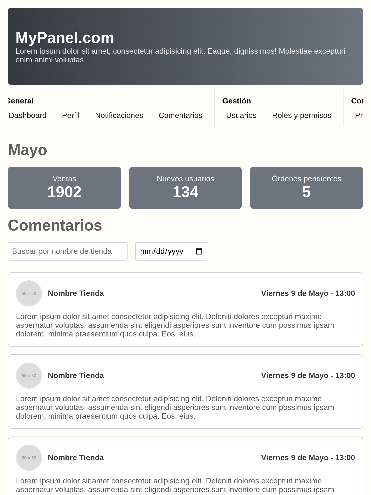
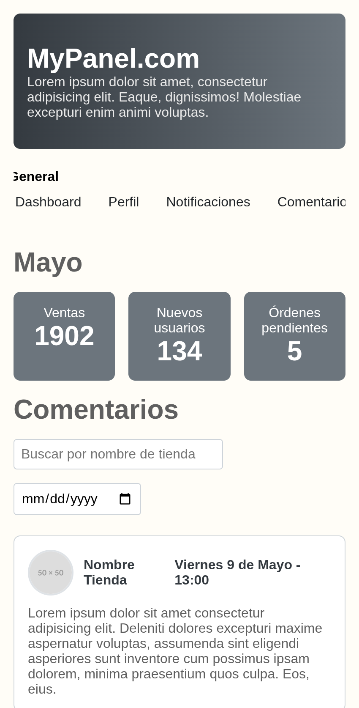

# Panel

# Vista de escritorio


# Vista tableta


# Vista móvil


# Creacion del proyecto

Este proyecto fue creado con el comando

```bash
npx create-react-app 4-react-panel --template typescript
```

No utiliza librerias externas a react, solo estilos css

# Componentes

Este proyecto cuenta con 4 componetes:

- `CardComentario` Componente que renderiza un comentario sobre una tienda, muestra el nombre de la tienda una imagen, fecha de emision de comentario y el comentario hecho

- `Filtro` Simulacion de filtro, que incluye un campo input texto y uno ded fecha ambos incluyen estilos con la pseudo clase `active` que hace que los inputs se escalen

- `ItemResumen` Componente que muestra cifras resumidas con efecto `hover`

- `Sidebar` Barra lateral dinamica que en pantallas pequenas se vuelve horizontal y scrolleable

# Estilos

Se dividieron en:

- `global` estilos pequenos que podrian reutilizarse varias veces dentro del proyecto

- `content` para el contenido del panel

- `grid` para el sistema de regillas usado

- `sidebar` Estilos de la barra lateral